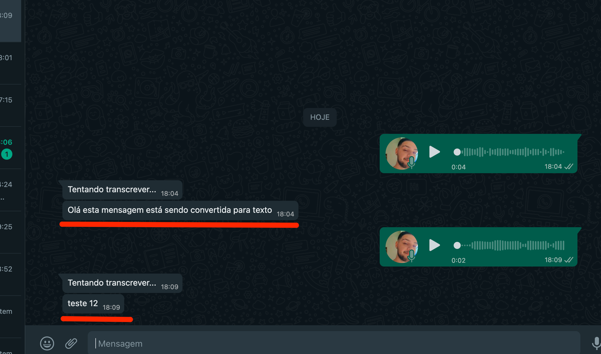

## WhatsApp Audio Transcription

Transcribe audios to text using WhatsApp.

## Usage

To use this project, you need to have Node.js installed in your environment and have an active Google Cloud API key with the Speech-to-Text service enabled.

Run the following command:

``` yarn dev || npm run dev ```

## Librarys

This project utilizes the following:

- Typescript
- Lib: Venom bot (Comunicação com whatsapp)
- Service: google-cloud/speech (Speech To Text)

### Usage example
